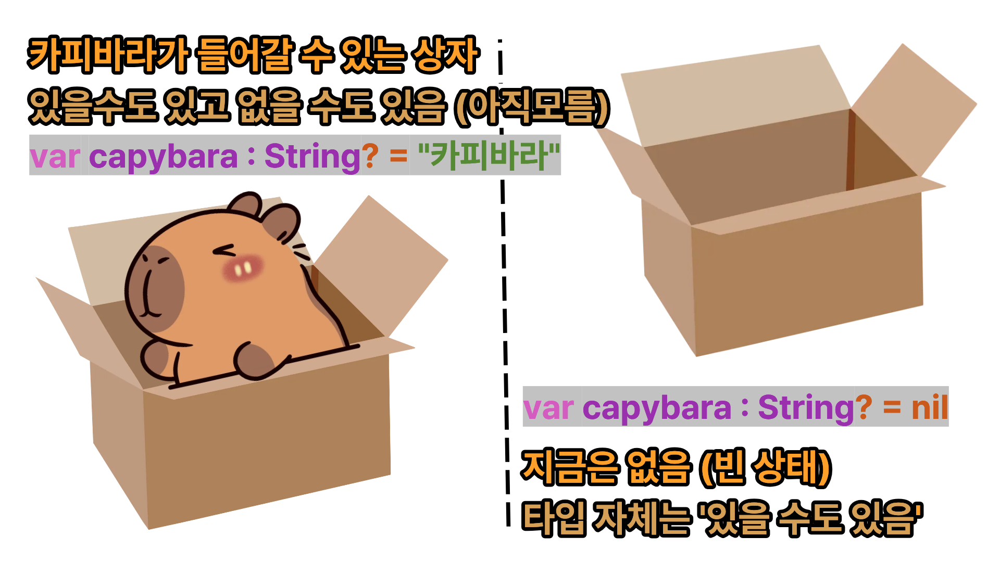

# 01 Optional (옵셔널)
→ 어떤 변수에 값이 있을수도 있고 없을수도 있는 임의적인 상태를 정의 내린 것 \
(nil 값 처리 개념의 대표 이기도 함)

## 1-1 옵셔널이 필요한 이유
(1) `nil`의 가능성을 명시적으로 표현
- nil의 가능성을 문서화 하지 않아도 코드만으로 충분히 표현 ⭕
    - 문서 / 주석 작성 시간을 절약
- 전달 받은 값이 옵셔널이 아니라면 nil 체크를 하지 않더라도 안심하고 사용
    - 효율적인 코딩
    - 예외 상황을 최소화하는 안전한 코딩

# 1-2 옵셔널 사용
`?`가 옵셔널 기호

**변수 선언에 대한 간단한 ex**
```swift
var capybara : int // 변수 capybara를 Int형 타입으로 선언
capybara = nil // Int형 타입 변수 capybara에 nil 값을 할당

➡️ 이렇게 컴파일하면 에러 발생
```
이 때 옵셔널을 쓰면?
```swift
var capybara : Int? // 변수 capybara를 Int형 타입으로 선언
capybara = nil // Int형 타입 변수 capybara에 nil 값을 할당
```
💡 옵셔널 변수는, 변수에 값이 없을 수도(nil) 있는 가능성을 열어줌, 이는 `?`를 사용해 나타냄

→ 그림으로 이해해보자 🐹

