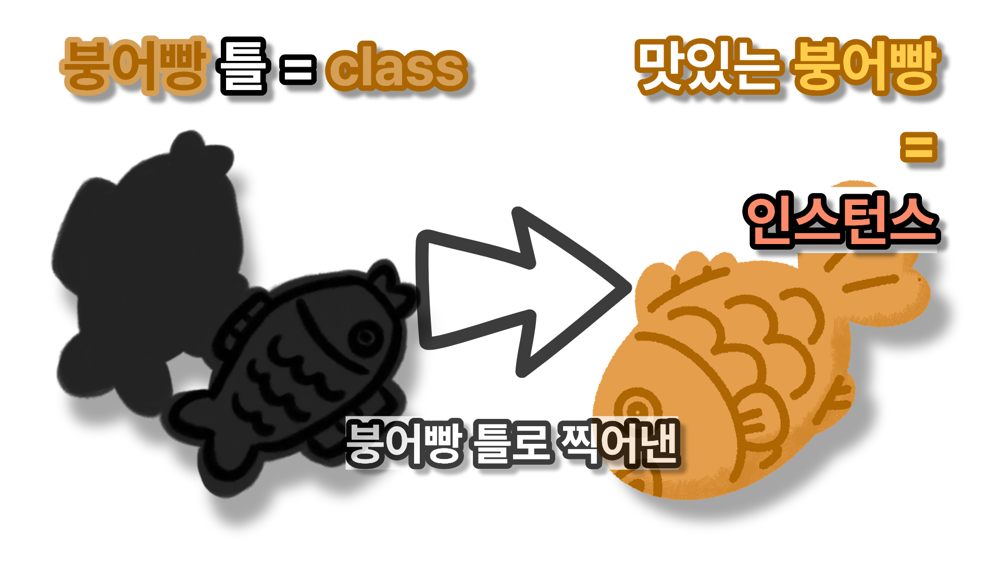

# 01 인스턴스의 생성과 소멸
**→ 인스턴스를 생성하는 *이니셜라이저* 와 클래스의 인스턴스가 소멸될 때 호출되는 *디이니셜라이저* 가 있음**

### 인스턴스란?

보이는 거와 같이 쉽게 설명해서 붕어빵 틀인 클래스로 찍어낸 맛있는 붕어빵이 인스턴스인 셈 \
((클래스, 구조체, 열거형)에서 생성된 객체를 '인스턴스'라고 함))
# 02 프로퍼티 기본값
모든 인스턴스는 초기화와 동시에 모든 프로퍼티에 유효한 값이 할당되어 있어야함 \
프로퍼티에 미리 기본값을 할당해두면 인스턴스가 생성됨가 동시에 초기값을 지님

⬇️⬇️
```swift
class Dog {
    var name: String = "치이카와"  // 기본값
    var age: Int = 1
}

let dog = Dog()

print(dog.name) // 치이카와
print(dog.age)  // 1
```
---


```swift
var dog = Dog()
dog.name = "우사기"

print(dog.name) // 우사기
```
기본값은 초기값일 뿐, 언제든 변경 가능함
# 03 이니셜 라이저 `init`
프로퍼티 기본값을 지정하기 어려운 경우 이니셜라이저 `init`을 통해 인스턴스가 가져야 할 초기값을 전달 가능

```swift
struct Dog {
    var name: String
    var age: Int

    init(name: String, age: Int) {
        self.name = name
        self.age = age
    }
}

let dog = Dog(name: "치이카와", age: 1)

print(dog.name) // 치이카와
```
무조건 객체 생성 / 실패 없음 ‼️
### 실패가능한 이니셜라이저
이니셜라이저 매개변수로 전달되는 초기값이 잘못된 경우 인스턴스 생성에 실패할 수 있음 \
인스턴스 생성에 실패하면 `nil`을 반환함, 그래서 실패가능한 이니셜라이저의 반환타입은 옵셔널 타입임 `init?`을 사용!!
```swift
struct Dog {
    var name: String
    var age: Int

    init?(name: String, age: Int) {
        if age < 0 {
            return nil  // 실패
        }
        self.name = name
        self.age = age
    }
}

let dog1 = Dog(name: "치이카와", age: 2)
let dog2 = Dog(name: "우사기", age: -1)

print(dog1?.name) // 옵셔널("치이카와")
print(dog2)       // nil
```
조건 실패 ➜ 객체 생성 안됨 / 결과 타입 = Optiopnal
# 04 디이니셜라이저 `deinit`
> 디이니셜라이저는 '클래스'에서 정리한 적이 있어 간단하게만 설명하겠다!

클래스의 인스턴스가 메모리에서 해제되는 시점에 호출, 인스턴스가 해제되는 시점에 해야할 일을 구현  자동으로 호출되므로 직접 호출할 수 없음 인스턴스가 메모리에서 해제되는 시점은 ARC(Automatic Reference Counting) 의 규칙에 따라 결정됨 디이니셜라이저는 클래스 타입에만 구현
(+ 매개변수를 가질 수 없음)

-ARC : 클래스 인스턴스의 메모리 사용을 자동으로 관리하는 기능

```swift
class cuteeee {
    var name: String

    init(name: String) {
        self.name = name
        print("\(name) 생성")
    }

    deinit {
        // 메모리에서 사라지기 직전에 호출됨
        print("\(name) 소멸")
    }
}

// 인스턴스 생성
var user : cuteee? = cuteeee(name:"하치와레는귀엽다")

// 인스턴스 소멸
user : nil
// == 하치와레는귀엽다 소멸
```